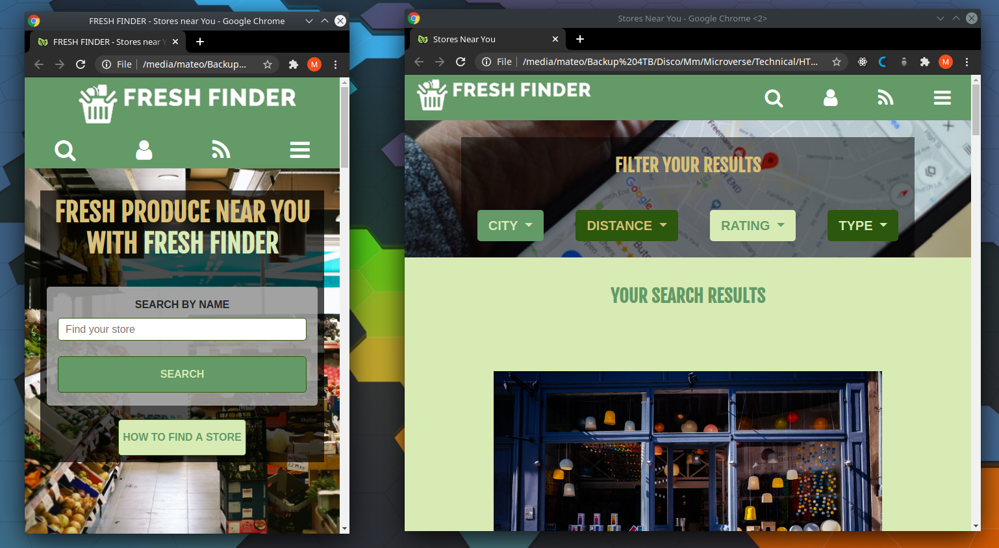

# FRESH FINDER - Grocery store finder

> This website was created to help local grocery stores expand their client base by getting their information posted online.

The is a responsive site for all the screen sizes, that has a search bar where you can look for your grocery store by name and filter the results by different criteria. Once you find the store you can get a brief description of the business, their contact information, the reviews provided by other users, and finally directions to get there.

This project was created as a Capstone project for the HTML/CSS module in the Mircoverse curriculum

## Built With

- HTML / CSS,
- Bootstrap,
- Flexbox and Grid combined with media queries

## Live Demo

[FRESH FINDER Live Demo](https://raw.githack.com/mateomh/Store-Finder/store-finder-page/index.html)

## Author

👤 **Mateo mojica**

- Github: [@mateomh](https://github.com/mateomh)
- Twitter: [@mateo_m_h](https://twitter.com/mateo_m_h)
- Linkedin: [Mateo mojica](https://linkedin.com/mateo_mojica_hernandez)

## 🤝 Contributing

Contributions, issues and feature requests are welcome!

Feel free to check the [issues page](issues/).

## Show your support

Give a ⭐️ if you like this project!

## Acknowledgments

- Bootstrap
- Microverse
- W3schools
- Fontawesome

## 📝 License

The images and some of the icons used on this page have authors that deserve credit for creating them. The following are the different authors that contributed in some way in the creation of this page:

### Photos:

[Mehrad Vosoughi](https://unsplash.com/@mehrad_vosoughi?utm_source=unsplash&amp;utm_medium=referral&amp;utm_content=creditCopyText) on [Unsplash](https://unsplash.com/s/photos/supermarket?utm_source=unsplash&amp;utm_medium=referral&amp;utm_content=creditCopyText)

[nrd](https://unsplash.com/@nicotitto?utm_source=unsplash&amp;utm_medium=referral&amp;utm_content=creditCopyText) on [Unsplash](https://unsplash.com/s/photos/supermarket?utm_source=unsplash&amp;utm_medium=referral&amp;utm_content=creditCopyText)

[Alexas_Fotos](https://pixabay.com/users/Alexas_Fotos-686414/?utm_source=link-attribution&amp;utm_medium=referral&amp;utm_campaign=image&amp;utm_content=1165437) from [Pixabay](https://pixabay.com/?utm_source=link-attribution&amp;utm_medium=referral&amp;utm_campaign=image&amp;utm_content=1165437)

[Blake Wisz](https://unsplash.com/@blakewisz?utm_source=unsplash&amp;utm_medium=referral&amp;utm_content=creditCopyText) on [Unsplash](https://unsplash.com/s/photos/supermarket?utm_source=unsplash&amp;utm_medium=referral&amp;utm_content=creditCopyText)

[Clay Banks](https://unsplash.com/@claybanks?utm_source=unsplash&amp;utm_medium=referral&amp;utm_content=creditCopyText) on [Unsplash](https://unsplash.com/s/photos/supermarket?utm_source=unsplash&amp;utm_medium=referral&amp;utm_content=creditCopyText)

[henry perks](https://unsplash.com/@hjkp?utm_source=unsplash&amp;utm_medium=referral&amp;utm_content=creditCopyText) on [Unsplash](https://unsplash.com/s/photos/supermarket?utm_source=unsplash&amp;utm_medium=referral&amp;utm_content=creditCopyText)

[Capturing the human heart.](https://unsplash.com/@dead____artist?utm_source=unsplash&amp;utm_medium=referral&amp;utm_content=creditCopyText) on [Unsplash](https://unsplash.com/s/photos/supermarket?utm_source=unsplash&amp;utm_medium=referral&amp;utm_content=creditCopyText)

[Mike Petrucci](https://unsplash.com/@mikepetrucci?utm_source=unsplash&amp;utm_medium=referral&amp;utm_content=creditCopyText) on [Unsplash](https://unsplash.com/s/photos/supermarket?utm_source=unsplash&amp;utm_medium=referral&amp;utm_content=creditCopyText)

[Artem Gavrysh](https://unsplash.com/@tmwd?utm_source=unsplash&amp;utm_medium=referral&amp;utm_content=creditCopyText) on [Unsplash](https://unsplash.com/s/photos/supermarket?utm_source=unsplash&amp;utm_medium=referral&amp;utm_content=creditCopyText)

[Fikri Rasyid](https://unsplash.com/@fikrirasyid?utm_source=unsplash&amp;utm_medium=referral&amp;utm_content=creditCopyText) on [Unsplash](https://unsplash.com/s/photos/supermarket?utm_source=unsplash&amp;utm_medium=referral&amp;utm_content=creditCopyText)

[Nathália Rosa](https://unsplash.com/@nathaliarosa?utm_source=unsplash&amp;utm_medium=referral&amp;utm_content=creditCopyText) on [Unsplash](https://unsplash.com/s/photos/supermarket?utm_source=unsplash&amp;utm_medium=referral&amp;utm_content=creditCopyText)

[Rob Maxwell](https://unsplash.com/@robmaxwell?utm_source=unsplash&amp;utm_medium=referral&amp;utm_content=creditCopyText) on [Unsplash](https://unsplash.com/s/photos/supermarket?utm_source=unsplash&amp;utm_medium=referral&amp;utm_content=creditCopyText)

[Hobi industri](https://unsplash.com/@hobiindustri?utm_source=unsplash&amp;utm_medium=referral&amp;utm_content=creditCopyText) on [Unsplash](https://unsplash.com/s/photos/supermarket?utm_source=unsplash&amp;utm_medium=referral&amp;utm_content=creditCopyText)

[Mehrad Vosoughi](https://unsplash.com/@mehrad_vosoughi?utm_source=unsplash&amp;utm_medium=referral&amp;utm_content=creditCopyText) on [Unsplash](https://unsplash.com/s/photos/supermarket?utm_source=unsplash&amp;utm_medium=referral&amp;utm_content=creditCopyText)

### Icons

[Freepik](https://www.flaticon.com/authors/freepik) from [www.flaticon.com](https://www.flaticon.com/)

[surang](https://www.flaticon.com/free-icon/placeholder_2942917) from [www.flaticon.com](https://www.flaticon.com/)

[Kiranshastry](https://www.flaticon.com/authors/kiranshastry) from [www.flaticon.com](https://www.flaticon.com/)

[Prosymbols](https://www.flaticon.com/authors/prosymbols) from [www.flaticon.com](https://www.flaticon.com/)

[iconixar](https://www.flaticon.com/authors/iconixar) from [www.flaticon.com](https://www.flaticon.com/)

This project is [MIT](lic.url) licensed.
